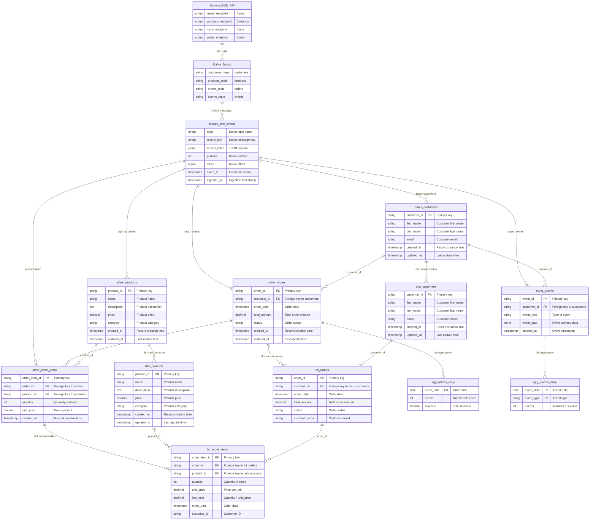

# ShopStream Analytics

## Overview
**ShopStream Analytics** is a modern data engineering project that demonstrates how to build a real-time Data Warehouse (DWH) and analytics platform using **streaming, batch processing, and medallion architecture**.  
The project ingests e-commerce datasets (customers, orders, products, events) from the **DummyJSON API** and processes them through an end-to-end pipeline.

---

## Pipeline Flow
 
1. **Ingestion**: Kafka producers fetch data from DummyJSON API and publish events.  
2. **Bronze Layer**: Kafka consumers write raw JSON into PostgreSQL.  
3. **Silver Layer**: Spark jobs (structured streaming + batch) clean and normalize data.  
4. **Gold Layer**: dbt models create analytics-ready tables (facts & dimensions).  
5. **Visualization**: BI dashboards show insights (sales, customers, product trends, events).  

## Architecture
The project follows the **Medallion Architecture**:

- **Bronze Layer (Raw Data)**  
  - Ingest raw data from DummyJSON API.  
  - Data stored in **PostgreSQL** (raw schema).  
  - Kafka streams simulate continuous ingestion.

- **Silver Layer (Cleaned & Processed Data)**  
  - Transformations using **DBT** (streaming + batch).  
  - Data deduplication, cleaning, and normalization.  
  - Stored in PostgreSQL (silver schema).

- **Gold Layer (Analytics-Ready Data)**  
  - Business logic and transformations via **dbt**.  
  - Fact and Dimension tables for analytics.  
  - Stored in PostgreSQL (gold schema).

## Data Model

---

<!-- ## Bronze Layer — Raw Data

Stores data exactly as it comes from DummyJSON API via Kafka producers. Raw events are appended to Postgres in `bronze.raw_events`.

- **Kafka → Postgres loader**: `kafka/consumers/postgres_loader.py`
  - Reads topics from `KAFKA_TOPICS` (default: `customers,orders,products`).
  - Ensures `bronze` schema and `bronze.raw_events` table exist.
  - Writes each message with metadata: `topic`, `record_key`, `record_value` (JSONB), `partition`, `offset`, `event_ts`, `ingested_at`.

- **Spark Structured Streaming (optional)**: `kafka/consumers/spark_streaming.py`
  - Reads the same Kafka topics and writes to `bronze.raw_events` via JDBC using `foreachBatch`. -->

<!-- ## Tech Stack
- **PostgreSQL** → Data Warehouse  
- **Apache Spark** → Real-time & batch processing  
- **Apache Kafka** → Streaming & message ingestion  
- **dbt** → Data transformations & modeling  
- **Airflow** → Orchestration & scheduling  
- **DummyJSON API** → Real-world e-commerce data source  
- **Power BI** → Visualization & dashboards   -->

<!-- ## Data Sources
The project uses the following API endpoints from DummyJSON:  
- `customers.raw` → `/users`  
- `orders.raw` → `/carts`  
- `products.raw` → `/products`  
- `events.raw` → `/posts`  -->

