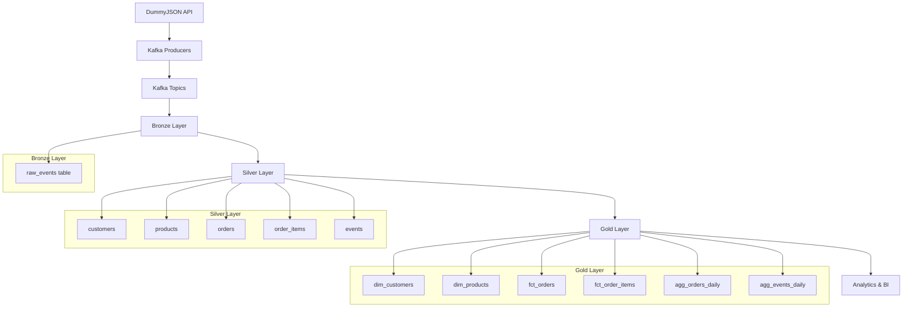
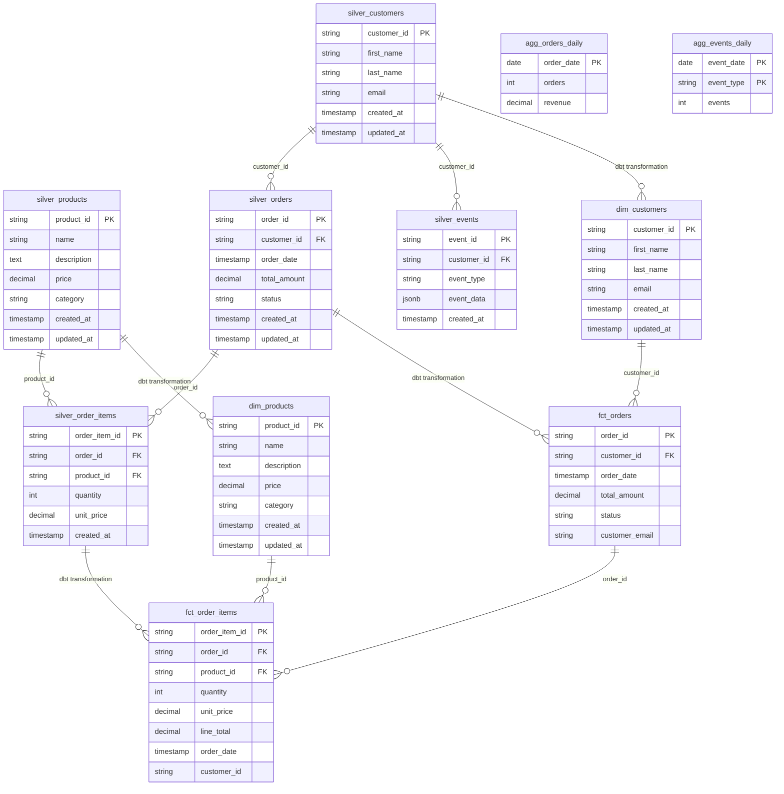

# ShopStream Analytics -Medallion Architecture Documentation

## Medallion Architecture

The Medallion Architecture provides a structured approach to data processing with three distinct layers:

###  Bronze Layer (Raw Data)
**Purpose**: Store data exactly as received from source systems
- **Storage**: PostgreSQL `bronze` schema
- **Table**: `bronze.raw_events`
- **Data Format**: Raw JSON payloads with Kafka metadata
- **Processing**: Append-only, no transformations

**Key Characteristics**:
- Preserves original data structure
- Includes Kafka metadata (topic, partition, offset, timestamps)
- Enables data lineage and audit trails
- Supports schema evolution

###  Silver Layer (Cleaned & Validated Data)
**Purpose**: Clean, validate, and standardize data for downstream consumption
- **Storage**: PostgreSQL `silver` schema
- **Tables**: `customers`, `products`, `orders`, `order_items`, `events`
- **Processing**: dbt transformations with incremental loading
- **Data Quality**: Validation, deduplication, type casting

**Key Characteristics**:
- Standardized schemas and data types
- Data quality checks and constraints
- Incremental processing for efficiency
- Business logic applied for consistency

###  Gold Layer (Analytics-Ready Data)
**Purpose**: Create business-ready datasets optimized for analytics and reporting
- **Storage**: PostgreSQL `gold` schema
- **Tables**: Dimensions, Facts, and Aggregations
- **Processing**: dbt models with business logic
- **Optimization**: Pre-computed metrics and aggregations

**Key Characteristics**:
- Star schema design (dimensions + facts)
- Pre-aggregated metrics for performance
- Business-friendly column names and structures
- Optimized for BI tools and dashboards

---

## Data Flow

### Processing Pipeline
1. **Ingestion**: Kafka producers fetch data from DummyJSON API endpoints
2. **Bronze**: Raw events stored in `bronze.raw_events` with metadata
3. **Silver**: dbt models clean and standardize data incrementally
4. **Gold**: Business logic applied to create analytics-ready datasets
5. **Consumption**: BI tools and dashboards consume from Gold layer

---

## Data Models

### Entity Relationship Diagram

---

## Schema Definitions

### Bronze Layer

#### `bronze.raw_events`
Raw events from Kafka streams with metadata preservation.

| Column | Type | Description |
|--------|------|-------------|
| `topic` | VARCHAR | Kafka topic name (customers, products, orders, events) |
| `record_key` | VARCHAR | Kafka message key |
| `record_value` | JSONB | Raw JSON payload from Kafka message |
| `partition` | INTEGER | Kafka partition number |
| `offset` | BIGINT | Kafka message offset |
| `event_ts` | TIMESTAMP | Event timestamp from source |
| `ingested_at` | TIMESTAMP | Ingestion timestamp |

### Silver Layer

#### `silver.customers`
Cleaned and normalized customer data.

| Column | Type | Description | Constraints |
|--------|------|-------------|-------------|
| `customer_id` | VARCHAR | Primary key | PK, NOT NULL, UNIQUE |
| `first_name` | VARCHAR | Customer's first name | |
| `last_name` | VARCHAR | Customer's last name | |
| `email` | VARCHAR | Customer's email address | NOT NULL, UNIQUE |
| `created_at` | TIMESTAMP | Record creation time | |
| `updated_at` | TIMESTAMP | Last update time | |

#### `silver.products`
Cleaned and normalized product data.

| Column | Type | Description | Constraints |
|--------|------|-------------|-------------|
| `product_id` | VARCHAR | Primary key | PK, NOT NULL, UNIQUE |
| `name` | VARCHAR | Product name | |
| `description` | TEXT | Product description | |
| `price` | DECIMAL | Product price | NOT NULL |
| `category` | VARCHAR | Product category | |
| `created_at` | TIMESTAMP | Record creation time | |
| `updated_at` | TIMESTAMP | Last update time | |

#### `silver.orders`
Cleaned and normalized order data.

| Column | Type | Description | Constraints |
|--------|------|-------------|-------------|
| `order_id` | VARCHAR | Primary key | PK, NOT NULL, UNIQUE |
| `customer_id` | VARCHAR | Foreign key to customers | NOT NULL, FK |
| `order_date` | TIMESTAMP | Date when order was placed | NOT NULL |
| `total_amount` | DECIMAL | Total order amount | NOT NULL |
| `status` | VARCHAR | Order status | |
| `created_at` | TIMESTAMP | Record creation time | |
| `updated_at` | TIMESTAMP | Last update time | |

#### `silver.order_items`
Cleaned and normalized order items data.

| Column | Type | Description | Constraints |
|--------|------|-------------|-------------|
| `order_item_id` | VARCHAR | Primary key | PK, NOT NULL, UNIQUE |
| `order_id` | VARCHAR | Foreign key to orders | NOT NULL, FK |
| `product_id` | VARCHAR | Foreign key to products | NOT NULL, FK |
| `quantity` | INTEGER | Quantity of product ordered | NOT NULL |
| `unit_price` | DECIMAL | Price per unit at time of order | NOT NULL |
| `created_at` | TIMESTAMP | Record creation time | |

#### `silver.events`
Cleaned and normalized event data.

| Column | Type | Description | Constraints |
|--------|------|-------------|-------------|
| `event_id` | VARCHAR | Primary key | PK, NOT NULL, UNIQUE |
| `customer_id` | VARCHAR | Foreign key to customers | NOT NULL, FK |
| `event_type` | VARCHAR | Type of event | NOT NULL |
| `event_data` | JSONB | JSON data associated with the event | |
| `created_at` | TIMESTAMP | When the event occurred | NOT NULL |

### Gold Layer

#### `gold.dim_customers`
Customer dimension table for analytics.

| Column | Type | Description | Constraints |
|--------|------|-------------|-------------|
| `customer_id` | VARCHAR | Primary key | PK, NOT NULL, UNIQUE |
| `first_name` | VARCHAR | Customer's first name | |
| `last_name` | VARCHAR | Customer's last name | |
| `email` | VARCHAR | Customer's email address | |
| `created_at` | TIMESTAMP | Record creation time | |
| `updated_at` | TIMESTAMP | Last update time | |

#### `gold.dim_products`
Product dimension table for analytics.

| Column | Type | Description | Constraints |
|--------|------|-------------|-------------|
| `product_id` | VARCHAR | Primary key | PK, NOT NULL, UNIQUE |
| `name` | VARCHAR | Product name | |
| `description` | TEXT | Product description | |
| `price` | DECIMAL | Product price | |
| `category` | VARCHAR | Product category | |
| `created_at` | TIMESTAMP | Record creation time | |
| `updated_at` | TIMESTAMP | Last update time | |

#### `gold.fct_orders`
Orders fact table for analytics.

| Column | Type | Description | Constraints |
|--------|------|-------------|-------------|
| `order_id` | VARCHAR | Primary key | PK, NOT NULL, UNIQUE |
| `customer_id` | VARCHAR | Foreign key to dim_customers | FK |
| `order_date` | TIMESTAMP | Order date | |
| `total_amount` | DECIMAL | Total order amount | |
| `status` | VARCHAR | Order status | |
| `customer_email` | VARCHAR | Customer email (denormalized) | |

#### `gold.fct_order_items`
Order items fact table for analytics.

| Column | Type | Description | Constraints |
|--------|------|-------------|-------------|
| `order_item_id` | VARCHAR | Primary key | PK, NOT NULL, UNIQUE |
| `order_id` | VARCHAR | Foreign key to fct_orders | FK |
| `product_id` | VARCHAR | Foreign key to dim_products | FK |
| `quantity` | INTEGER | Quantity ordered | |
| `unit_price` | DECIMAL | Price per unit | |
| `line_total` | DECIMAL | Calculated: quantity * unit_price | |
| `order_date` | TIMESTAMP | Order date (denormalized) | |
| `customer_id` | VARCHAR | Customer ID (denormalized) | |

#### `gold.agg_orders_daily`
Daily order aggregations for performance.

| Column | Type | Description | Constraints |
|--------|------|-------------|-------------|
| `order_date` | DATE | Order date | PK, NOT NULL |
| `orders` | INTEGER | Number of orders | |
| `revenue` | DECIMAL | Total revenue | |

#### `gold.agg_events_daily`
Daily event aggregations for performance.

| Column | Type | Description | Constraints |
|--------|------|-------------|-------------|
| `event_date` | DATE | Event date | PK, NOT NULL |
| `event_type` | VARCHAR | Event type | PK, NOT NULL |
| `events` | INTEGER | Number of events | |

---

